# oxygrace

A pure-Rust toolkit for [Grace](https://plasma-gate.weizmann.ac.il/Grace/)
(xmgrace) plot files: a rendering library, a headless command-line renderer
and an interactive GUI editor. It reads `.agr` / `.xvg` files and renders
them to antialiased PNG images or clean vector SVG — no X11, no external C
libraries.

Grace is a venerable 2D plotting tool whose file formats are still produced
by a lot of scientific software (GROMACS and friends emit `.xvg`). oxygrace
turns those files into images anywhere — servers, CI pipelines, containers —
and lets you edit them in a modern GUI, without installing Grace itself.

The workspace contains three crates:

| Crate | What it is |
|---|---|
| [`oxygrace`](oxygrace/) | The core library: parser, data model, PNG/SVG renderer, `.agr` writer |
| [`oxygrace-cli`](oxygrace-cli/) | Headless renderer (`oxygrace plot.agr -o plot.png`) |
| [`oxygrace-gui`](oxygrace-gui/) | Interactive editor (native and in the browser via WebAssembly) |

## Gallery

All images below were rendered by oxygrace from the standard Grace example
projects.

| | |
|:---:|:---:|
| 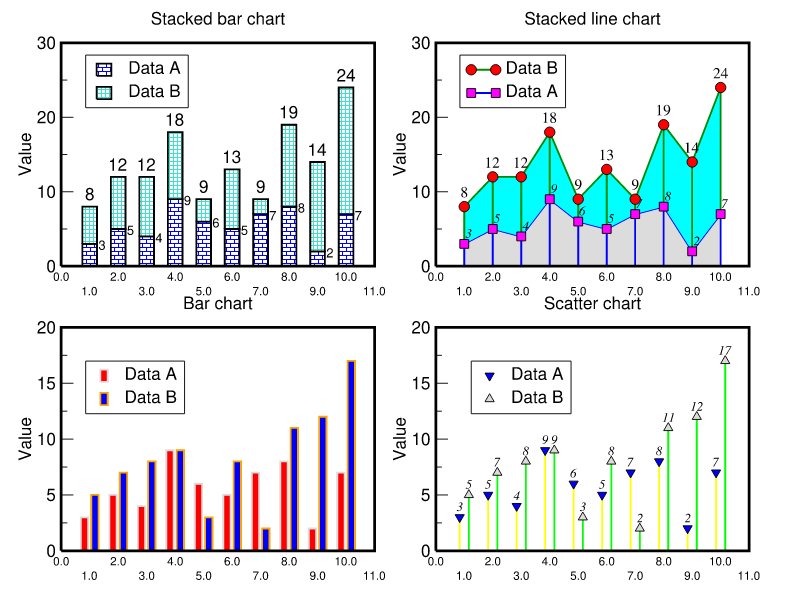 | 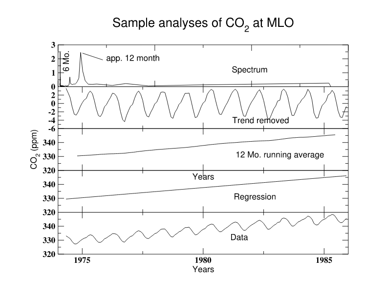 |
| *Stacked / grouped charts, value labels, fills* | *Multi-panel layouts, annotations, callouts* |
| 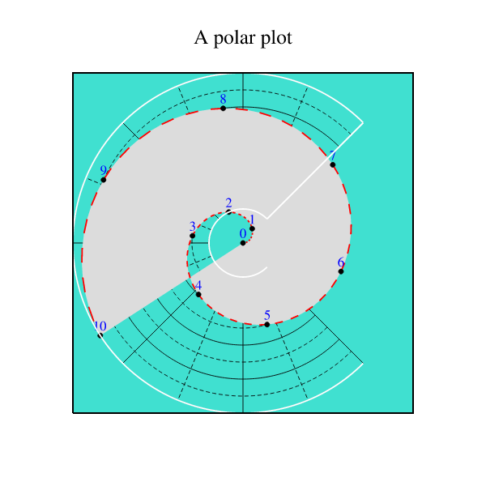 | 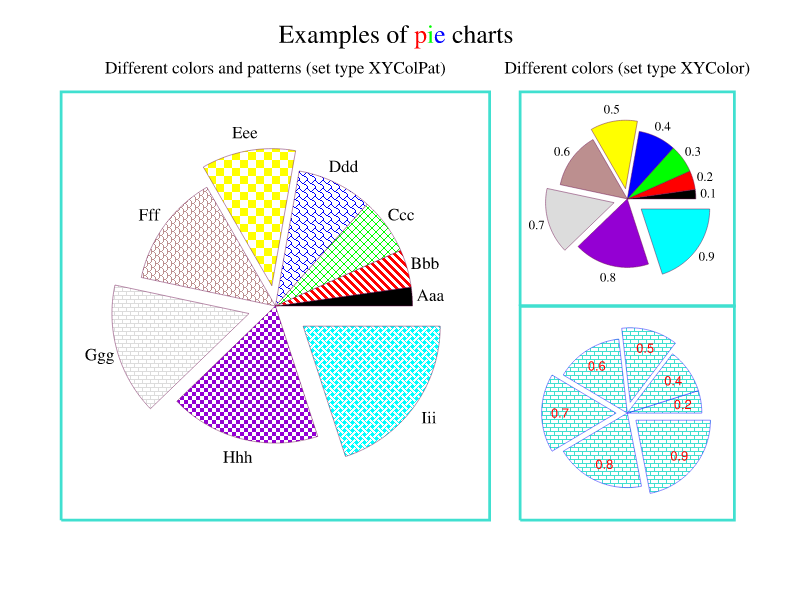 |
| *Polar graphs* | *Pie charts with patterns and exploded slices* |
| 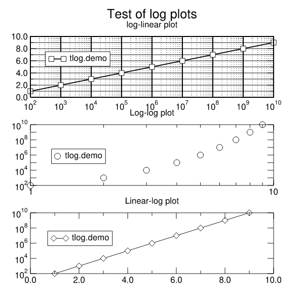 | 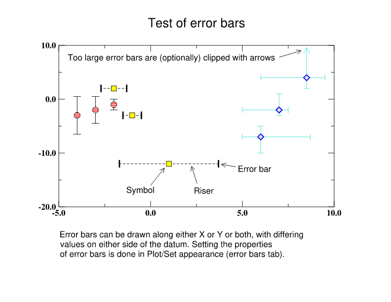 |
| *Log scales with power-format labels* | *X/Y error bars, clipped risers* |
| 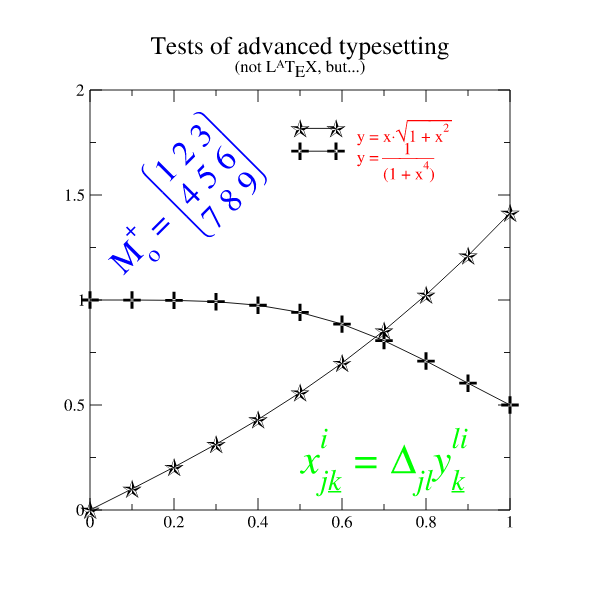 | 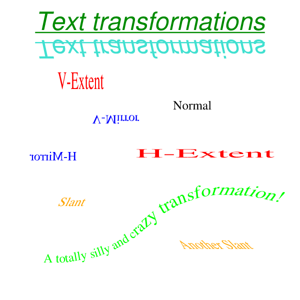 |
| *Typesetting: sub/superscripts, Greek, fractions* | *Text transformations: mirror, slant, per-glyph rotation* |
| 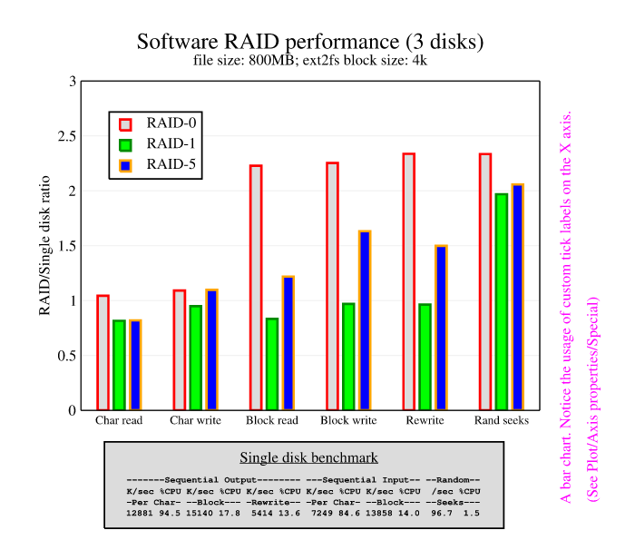 | 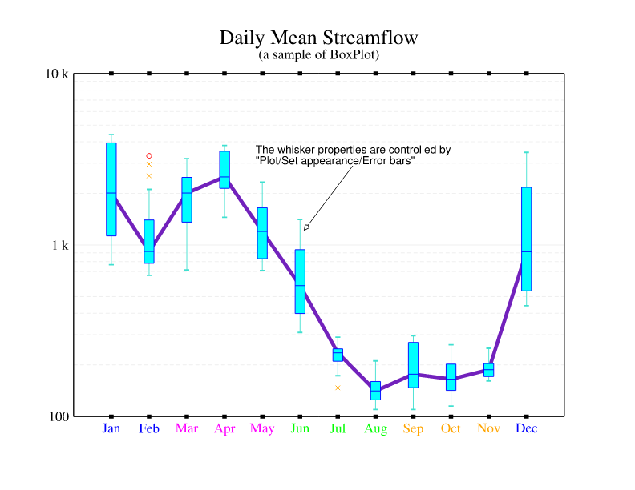 |
| *Bar charts with error bars* | *Boxplots* |

## Features

- **Graph types** — XY graphs, charts (grouped and stacked), polar plots,
  pie charts, fixed-scale graphs, inset graphs and free multi-graph layouts.
- **Dataset types** — lines, scatter symbols (including character symbols),
  bars with error bars, X/Y error bars, hi–lo–open–close, boxplots,
  XY-radius circles, vector maps, per-point sizes and colors.
- **Axes** — linear, logarithmic, reciprocal and logit scales; automatic and
  explicit ticks; custom tick labels; tick-label formulas (`$t - 273.15`);
  decimal / general / exponential / scientific / engineering / computing /
  power formats; geographic (`110E`, `10S`) and date/time formats; staggered
  and skipped labels; zero axes, offset axes and per-side placement.
- **Annotations** — text strings, lines with arrowheads, boxes, ellipses and
  timestamps, in world or page coordinates.
- **Typesetting** — Grace's full text markup: fonts, colors, sub- and
  superscripts, under/overline, Symbol-font Greek, size changes, and text
  transformations (rotation, mirroring, slanting).
- **Styling** — Grace's default palette with `@map color` overrides, all 32
  fill patterns, the nine dash styles, legends, frames and background fills.
- **Output** — antialiased PNG and vector SVG from the same drawing code;
  in SVG, text is emitted as glyph outlines, so documents display
  identically everywhere with no font dependencies.
- **Round trip** — projects can be written back to `.agr` (used by the GUI's
  save), staying loadable by Grace and QtGrace.
- **Fonts** — ships with the URW base35 fonts (metric-compatible with
  Grace's PostScript set) embedded in the binary; no font installation
  needed.
- **Compatibility** — reads files written by xmgr 4.x, Grace 5.x and
  QtGrace, including legacy formats; the tolerant parser skips unknown
  commands instead of failing.
- **Scales to huge data** — million-point datasets render interactively
  (pixel-equivalent polyline aggregation and symbol deduplication kick in
  only on pathologically dense sets).

The output aims to be *visibly identical* to Grace's own rendering — same
layout math, same defaults, same fonts — and is validated side by side
against the original Grace renderer over the full Grace example corpus.
(Exact pixel parity is a non-goal: oxygrace antialiases everything.)

## Installation

With a [Rust toolchain](https://rustup.rs) installed:

```bash
cargo install --git https://github.com/yesint/oxygrace oxygrace-cli   # the `oxygrace` command
cargo install --git https://github.com/yesint/oxygrace oxygrace-gui  # the GUI editor
```

or clone and build:

```bash
git clone https://github.com/yesint/oxygrace
cd oxygrace
cargo build --release -p oxygrace-cli   # binary in target/release/oxygrace
cargo build --release -p oxygrace-gui   # binary in target/release/oxygrace-gui
```

## The command-line renderer

`oxygrace-cli` installs a binary named `oxygrace` that converts Grace
projects to images, headlessly:

```bash
oxygrace input.agr                  # writes input.png next to the input
oxygrace input.agr -o out.png       # explicit output path
oxygrace input.agr -o out.svg       # SVG output (chosen by extension)
oxygrace input.agr --width 1584 --height 1224   # override the page size
```

## The GUI editor

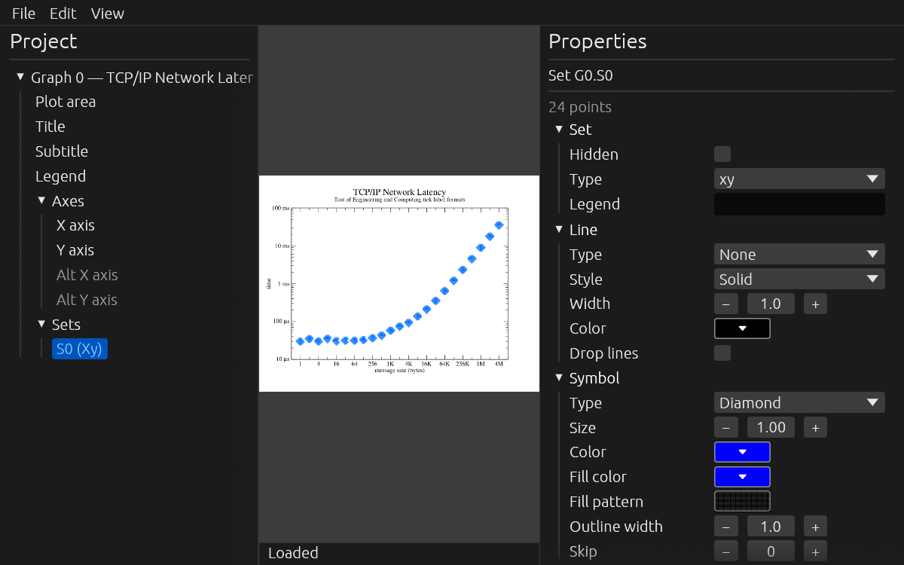

`oxygrace-gui` is an interactive editor for Grace projects with a modern
layout: a project tree on the left, the plot in the middle, and a
standardized property inspector docked on the right (no floating dialog
windows). It is forward-compatible with Grace: it opens existing `.agr` /
`.xvg` files and saves regular `.agr` files that Grace and QtGrace load.

- **Direct selection** — click any plot element (curves, symbols, axes,
  tick labels, legend, titles, annotations) to select and edit it; clicking
  the same spot again cycles through overlapping elements; hovering
  identifies elements in the status bar.
- **Property inspector** — every property in collapsible sections with
  color/pattern swatch pickers, spin buttons and live preview; the section
  for the element you clicked opens automatically.
- **Direct manipulation** — drag the legend, text, lines, boxes and
  ellipses; resize the plot viewport with selection handles; move line
  endpoints individually; rotate text with a second click.
- **Undo/redo** — every edit and every drag gesture is one undo step
  (Ctrl+Z / Ctrl+Shift+Z).
- **xmgrace-style command line** — `oxygrace-gui project.agr`,
  `-xy data.dat`, `-nxy multi_column.dat`, `-type TYPE`, `-free`.
- **View options** — dark/light/system theme, free page aspect (the page
  follows the window).

```bash
oxygrace-gui examples/co2.agr
oxygrace-gui -nxy results.dat            # plot a multi-column data file
```

### In the browser

The same editor compiles to WebAssembly. To run it locally you need
[trunk](https://trunkrs.dev):

```bash
cd oxygrace-gui
trunk serve --release      # then open http://127.0.0.1:8080/
```

`trunk build --release` produces a static bundle in `oxygrace-gui/dist/`
that can be hosted anywhere; `.github/workflows/web-demo.yml` deploys it to
GitHub Pages. In the browser, File → Open uses the file picker and Save
downloads the `.agr` file.

## The library

```rust
let project = oxygrace::load("plot.agr")?;
let png = oxygrace::render_png(&project);   // Vec<u8>
let svg = oxygrace::render_svg(&project);   // String
std::fs::write("plot.png", png)?;

// For interactive use: raw pixmap + hit-test geometry, and saving.
let fonts = oxygrace::FontSet::load();
let result = oxygrace::render_pixmap(&project, &fonts);
let hit = result.info.hit_test(400.0, 300.0, 4.0);  // what's at this pixel?
oxygrace::save(&project, "edited.agr")?;
```

## Not supported

- Smith charts (Grace itself never implemented drawing them).
- PostScript output.
- Grace's interactive command/scripting language — oxygrace renders project
  files, it does not evaluate scripts.

## License

MIT. The bundled
[URW base35 fonts](https://github.com/ArtifexSoftware/urw-base35-fonts) are
distributed under their own license (see `oxygrace/assets/fonts`).
