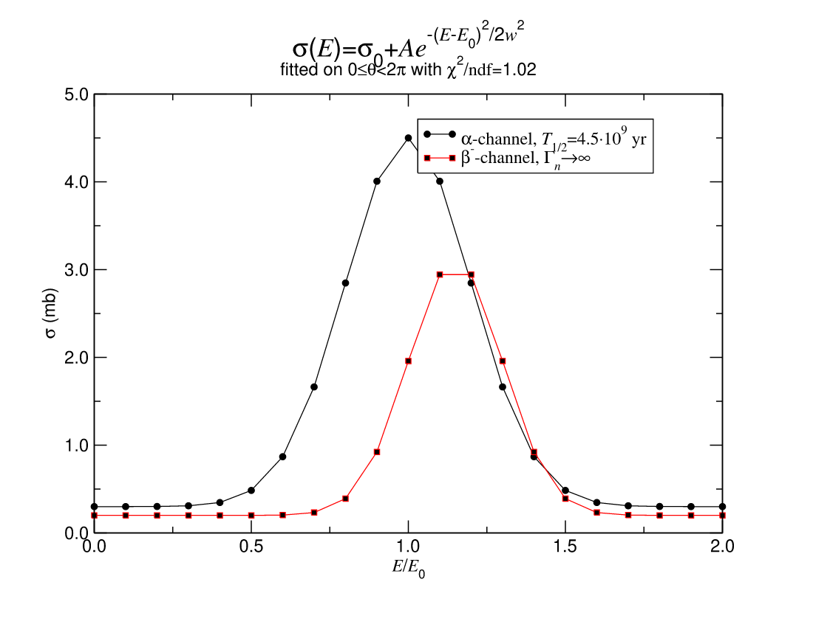

# oxygrace

A pure-Rust toolkit for [Grace](https://plasma-gate.weizmann.ac.il/Grace/)
(xmgrace) plot files: a rendering library, a headless command-line renderer
and an interactive GUI editor that also runs in the browser. It reads
`.agr` / `.xvg` files and turns them into antialiased PNG or clean vector
SVG — no X11, no external C libraries, no Grace installation.

Decades of scientific software speak Grace's formats — GROMACS and friends
still emit `.xvg` today, and countless published figures live in `.agr`
projects. oxygrace is for three situations:

- **Rendering those files anywhere.** One static binary converts them to
  images on servers, in CI pipelines and containers, or from your own code —
  places where installing Grace and an X server is a non-starter.
- **Continuing to edit them.** The GUI is a modern take on the Grace editor:
  click any element on the plot to edit it, with undo, direct dragging and a
  clean property inspector. It saves ordinary `.agr` files that Grace and
  QtGrace still load, so your archive stays portable.
- **Writing math the way you think it.** Any label accepts LaTeX math —
  `$\sigma_0 e^{-E/kT}$` just works — on top of Grace's native typesetting.

The workspace contains three crates:

| Crate | What it is |
|---|---|
| [`oxygrace`](oxygrace/) | The core library: parser, data model, PNG/SVG renderer, `.agr`/`.oxgr` writer |
| [`oxygrace-cli`](oxygrace-cli/) | Headless renderer and converter (`oxygrace plot.agr -o plot.png`) |
| [`oxygrace-gui`](oxygrace-gui/) | Interactive editor (native and in the browser via WebAssembly) |

## Quick start

With a [Rust toolchain](https://rustup.rs) installed:

```bash
cargo install --git https://github.com/yesint/oxygrace oxygrace-cli   # the `oxygrace` command
cargo install --git https://github.com/yesint/oxygrace oxygrace-gui   # the GUI editor

oxygrace results.agr                # → results.png, no display needed
oxygrace-gui results.agr            # open the editor
```

Or skip installing entirely — **the editor runs in your browser at
<https://yesint.github.io/oxygrace/>**.

## Gallery

All images below were rendered by oxygrace from standard Grace example
projects (plus one showing the LaTeX extension).

| | |
|:---:|:---:|
|  |  |
| *Stacked / grouped charts, value labels, fills* | *Multi-panel layouts, annotations, callouts* |
|  |  |
| *Polar graphs* | *Pie charts with patterns and exploded slices* |
|  |  |
| *Log scales with power-format labels* | *X/Y error bars, clipped risers* |
|  |  |
| *Grace typesetting: sub/superscripts, Greek, fractions* | *The same, written as LaTeX: `$\sigma(E) = \sigma_0 + A e^{-(E-E_0)^2/2w^2}$`* |
|  |  |
| *Bar charts with error bars* | *Boxplots* |

## Features

- **Graph types** — XY graphs, charts (grouped and stacked), polar plots,
  pie charts, fixed-scale graphs, inset graphs and free multi-graph layouts.
- **Dataset types** — lines, scatter symbols (including character symbols),
  bars with error bars, X/Y error bars, hi–lo–open–close, boxplots,
  XY-radius circles, vector maps, per-point sizes and colors.
- **Axes** — linear, logarithmic, reciprocal and logit scales; automatic and
  explicit ticks; custom tick labels; tick-label formulas (`$t - 273.15`);
  decimal / general / exponential / scientific / engineering / computing /
  power formats; geographic (`110E`, `10S`) and date/time formats; staggered
  and skipped labels; zero axes, offset axes and per-side placement.
- **Annotations** — text strings, lines with arrowheads, boxes, ellipses and
  timestamps, in world or page coordinates.
- **Typesetting** — Grace's full text markup: fonts, colors, sub- and
  superscripts, under/overline, Symbol-font Greek, size changes, and text
  transformations (rotation, mirroring, slanting).
- **LaTeX math** *(oxygrace extension)* — write `$...$` in any label:
  Greek and operators (`\alpha`, `\pm`, `\infty`, `\sum`, …), nested
  super/subscripts, `\sqrt`, `\bar`, `\mathrm`/`\mathbf`, upright function
  names. Transpiled to Grace markup internally, so it renders in PNG, SVG
  and the GUI alike; strings without math pass through untouched.
- **Styling** — Grace's default palette with `@map color` overrides, all 32
  fill patterns, the nine dash styles, legends, frames, background fills,
  and per-set opacity (QtGrace's alpha-channel extension, read and written).
- **Output** — antialiased PNG and vector SVG from the same drawing code;
  in SVG, text is emitted as glyph outlines, so documents display
  identically everywhere with no font dependencies.
- **File formats** — reads files written by xmgr 4.x, Grace 5.x and QtGrace,
  including legacy formats (the tolerant parser skips unknown commands
  instead of failing); writes `.agr` back, loadable by Grace and QtGrace.
  There is also a native `.oxgr` format — a readable, hand-editable RON
  document about 30 % smaller than `.agr` and forward-compatible by design;
  the CLI converts between formats by extension.
- **Fonts** — ships with the URW base35 fonts (metric-compatible with
  Grace's PostScript set) embedded in the binary; no font installation
  needed.
- **Scales to huge data** — million-point datasets render interactively
  (pixel-equivalent polyline aggregation and symbol deduplication kick in
  only on pathologically dense sets).

The output aims to be *visibly identical* to Grace's own rendering — same
layout math, same defaults, same fonts — and is validated side by side
against the original Grace renderer over the full Grace example corpus.
(Exact pixel parity is a non-goal: oxygrace antialiases everything.)

## The command-line renderer

`oxygrace-cli` installs a binary named `oxygrace` that converts Grace
projects to images — and between project formats — headlessly:

```bash
oxygrace input.agr                  # writes input.png next to the input
oxygrace input.agr -o out.png       # explicit output path
oxygrace input.agr -o out.svg       # SVG output (chosen by extension)
oxygrace input.agr -o out.oxgr      # convert to the native format (and back)
oxygrace input.agr --width 1584 --height 1224   # override the page size
```

## The GUI editor


`oxygrace-gui` replaces Grace's maze of floating dialogs with one coherent
window: a project tree, the plot, and a property inspector that always
shows exactly the element you selected — nothing else. Click a curve, an
axis label or a legend on the canvas and the same element highlights in
the tree and opens in the inspector; a breadcrumb
(`Page › Graph 0 › X axis › Tick labels`) tracks where you are and walks
back up. It opens existing `.agr` / `.xvg` / `.oxgr` files and saves
regular `.agr` that Grace and QtGrace load.

- **Direct selection** — click any plot element to edit it; clicking the
  same spot again cycles through overlapping elements; hovering identifies
  elements in the status bar. Selection outlines are drawn *around* the
  data, never on it, so you can watch colors and widths change as you edit.
- **Direct manipulation** — drag the legend, text, lines, boxes and
  ellipses; resize the plot viewport with selection handles; move line
  endpoints individually; rotate text with a second click; pan the world
  window with the hand tool.
- **Toolbar tools** — open/save, autoscale everything, autoscale to one
  clicked set, pan, and free page aspect (the page follows the window).
- **Undo/redo** — every edit and every drag gesture is one undo step
  (Ctrl+Z / Ctrl+Shift+Z).
- **LaTeX input** — type `$\Gamma_n \to \infty$` into any text field and
  the plot renders it; the tree shows it as readable Unicode (`Γn→∞`).
- **Layout & theme** — the inspector docks to the right of the plot or
  stacks below the tree (Edit → Settings, remembered across sessions);
  dark, light or follow-the-system theme.
- **xmgrace-style command line** — `oxygrace-gui project.agr`,
  `-xy data.dat`, `-nxy multi_column.dat`, `-type TYPE`, `-free`.

```bash
oxygrace-gui examples/co2.agr
oxygrace-gui -nxy results.dat            # plot a multi-column data file
```

### In the browser

The same editor compiles to WebAssembly — **try the live demo at
<https://yesint.github.io/oxygrace/>**. File → Open uses the browser's file
picker, Save downloads the `.agr`, and your settings persist in local
storage.

To run it locally you need [trunk](https://github.com/trunk-rs/trunk):

```bash
cd oxygrace-gui
trunk serve --release      # then open http://127.0.0.1:8080/
```

`trunk build --release` produces a static bundle in `oxygrace-gui/dist/`
that can be hosted anywhere; `.github/workflows/web-demo.yml` deploys it to
GitHub Pages.

## The library

```rust
let project = oxygrace::load("plot.agr")?;   // or .oxgr — picked by extension
let png = oxygrace::render_png(&project);    // Vec<u8>
let svg = oxygrace::render_svg(&project);    // String
std::fs::write("plot.png", png)?;

// For interactive use: raw pixmap + hit-test geometry, and saving.
let fonts = oxygrace::FontSet::load();
let result = oxygrace::render_pixmap(&project, &fonts);
let hit = result.info.hit_test(400.0, 300.0, 4.0);  // what's at this pixel?
oxygrace::save(&project, "edited.agr")?;
```

Everything the GUI does goes through this API: the model is plain Rust
structs you can build or mutate, rendering returns hit-test geometry for
picking, and the writer round-trips projects byte-stably.

## Not supported

- Smith charts (Grace itself never implemented drawing them).
- PostScript output.
- Grace's interactive command/scripting language — oxygrace renders project
  files, it does not evaluate scripts.

## License

MIT. The bundled
[URW base35 fonts](https://github.com/ArtifexSoftware/urw-base35-fonts) are
distributed under their own license (see `oxygrace/assets/fonts`).
